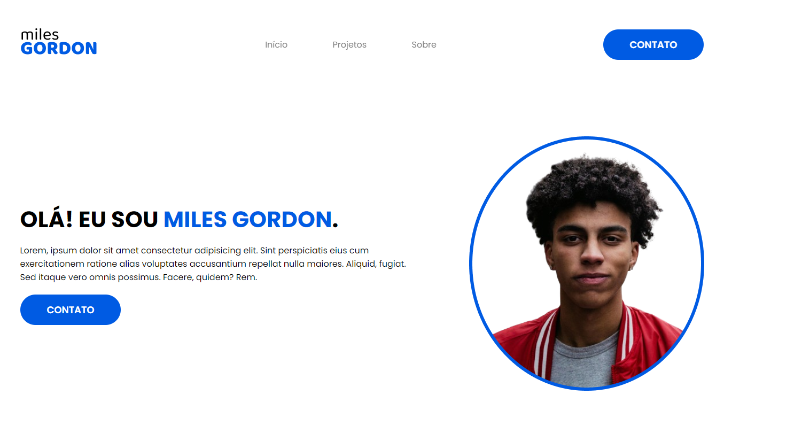

# PROJETO ESCOLAR - SITE PORTFOLIO

##  Olá! Criei este site portfolio para um Projeto Escolar
Neste projeto foram realizados 4 projetos no Spline em 3D e este site foi feito com o propósito de mostrar as pessoas estes projetos e falar um pouco sobre o autor deste projeto!

## LINGUAGENS UTILIZADAS: 

